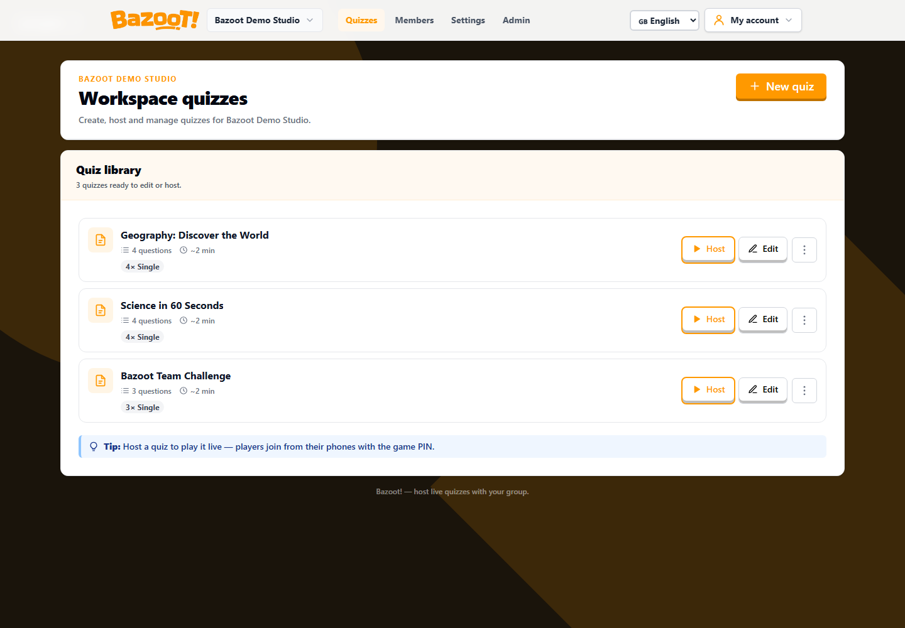
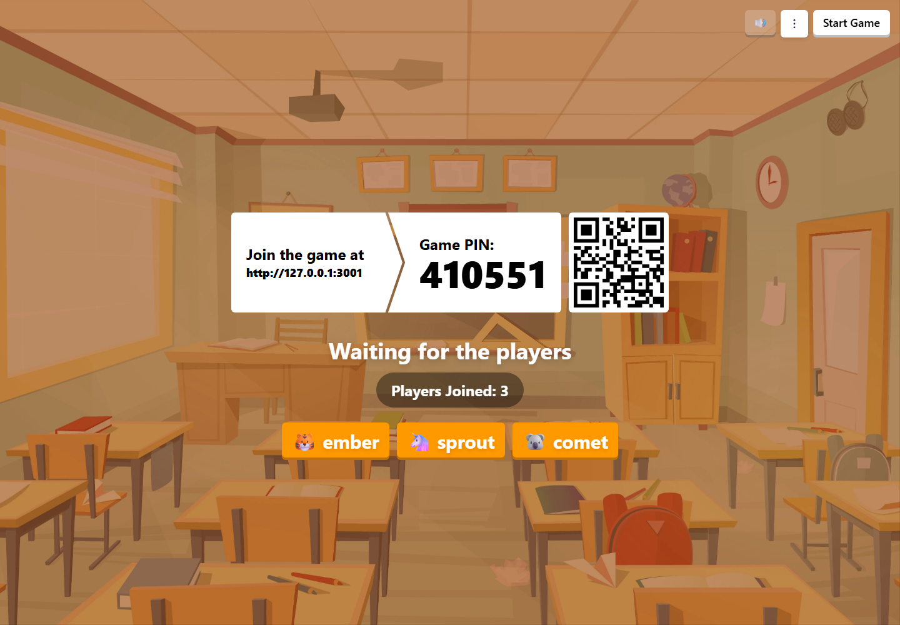
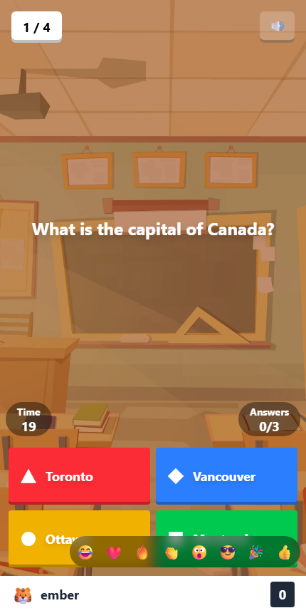

  

  <strong>A self-hosted, real-time quiz game for classrooms, teams, and events.</strong>

  Create a quiz, share a PIN or QR code, and play together from any modern browser.

## Preview

| Live lobby | Player view |
| --- | --- |
|  |  |

## Features

- Create and manage quizzes directly in the browser.
- Use single-choice, true/false, multi-select, and ordering questions.
- Add images, video, and audio to questions.
- Let players join with a six-digit PIN or QR code—no account required.
- Run live games with timers, scoring, streaks, leaderboards, and a podium.
- Organize quizzes and media in workspaces with owner, admin, and editor roles.
- Host Bazoot yourself and keep control of your data.

## How it works

1. A manager creates a workspace and builds a quiz.
2. The host opens a lobby and shares its PIN or QR code.
3. Players join from their phones or computers and choose a name.
4. The host runs the quiz while Bazoot handles answers, scoring, and results in real time.

## Run locally

Requires Node.js 22.13 or newer and npm.

~~~bash
git clone https://github.com/Xusr404/Bazoot.git
cd Bazoot
npm install
npm run dev
~~~

Open <http://localhost:5005> to join a game or <http://localhost:5005/manager> to create and host quizzes.

On a new installation, the first manager account becomes the owner of the initial workspace.

## Self-hosting

Start Bazoot with Docker Compose:

~~~bash
docker compose up --build
~~~

Bazoot is then available at <http://localhost:5005>, with application data stored in the persistent `bazoot-data` volume.

Before making an installation public, configure HTTPS, its public URL, email delivery, access controls, and backups. See the [deployment guide](docs/DEPLOYMENT.md) for production setup and upgrade instructions.

## Configuration

All available server settings are documented in [server/.env.example](server/.env.example), including registration, email, storage, session, game-limit, and Redis options.

## Documentation

- [Deployment guide](docs/DEPLOYMENT.md)
- [Architecture](docs/architecture.md)
- [Environment reference](server/.env.example)

## Development

~~~bash
npm test
npm run build
~~~

Bazoot is under active development, and breaking changes are possible before the first stable release.

## License

Bazoot is licensed under the [GNU Affero General Public License v3.0 only (AGPL-3.0-only)](https://www.gnu.org/licenses/agpl-3.0.en.html).

You may use, modify, and self-host Bazoot. If you run a modified version for users over a network, you must offer those users the corresponding source code for that version.
